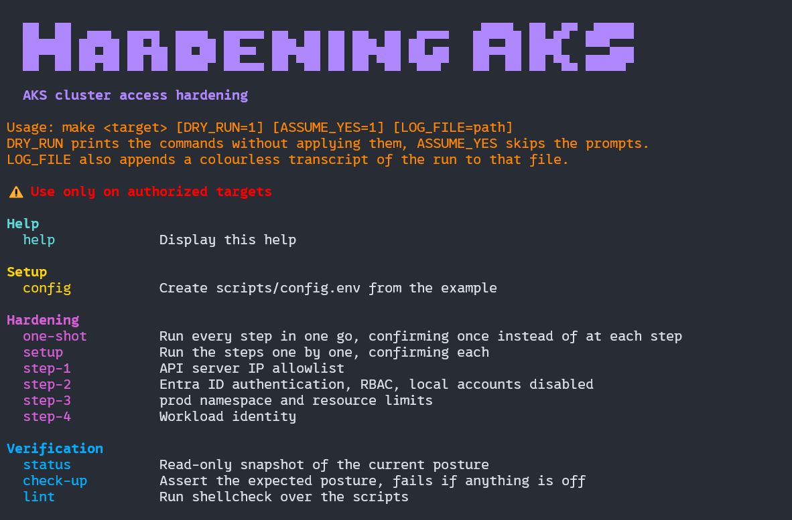

# AKS cluster access hardening

A production AKS cluster was reachable by every user of the Azure subscription,
from anywhere on the internet, through a local admin account that bypassed
corporate identity entirely.

This repository documents how that was fixed, step by step, and automates it.

## What was applied

| Step | Change | Runbook |
| --- | --- | --- |
| 1 | The API server only answers a known IP range | [01-whitelist-ip](docs/steps/01-whitelist-ip.md) |
| 2 | Access goes through Microsoft Entra ID groups, local accounts are off | [02-entra-id-rbac](docs/steps/02-entra-id-rbac.md) |
| 3 | The `prod` namespace has a resource limitation policy | [03-prod-namespace-limits](docs/steps/03-prod-namespace-limits.md) |
| 4 | Pods authenticate to Azure without any stored secret | [04-workload-identity](docs/steps/04-workload-identity.md) |

Each runbook states what changes, what to expect, how to verify it, and how to
roll it back.

Two Entra ID groups drive cluster access: one grants full administration, the
other read only.

## Quick start

```bash
make config          # create scripts/config.env, then edit it
make help            # list every target
make status          # read-only snapshot, changes nothing
make one-shot        # apply every step, confirming once
make check-up        # assert the expected posture, non-zero exit if not
```



`make setup` runs the same steps one by one, confirming each. Add `DRY_RUN=1` to
print the commands without applying them, or `LOG_FILE=logs/run.log` to keep a
timestamped transcript.

The steps refuse to lock you out: an allowlist that does not cover your own
address, or disabling local accounts while the admin group is empty, both stop
and ask.

## Layout

```
docs/consignes/   the mission statement
docs/steps/       one runbook per step, with screenshots
docs/images/      the screenshots used by this readme
k8s/              the manifests applied to the cluster
scripts/          one script per step, plus status and check
Makefile          the entry point
```

## Requirements

Azure CLI, `kubectl` and `kubelogin` (`az aks install-cli` installs the last
two), an AKS cluster with a Standard load balancer, and the right to create
Entra ID groups in the tenant.

Environment specific values live in `scripts/config.env`, which is ignored by
git. Start from `scripts/config.env.example`.
