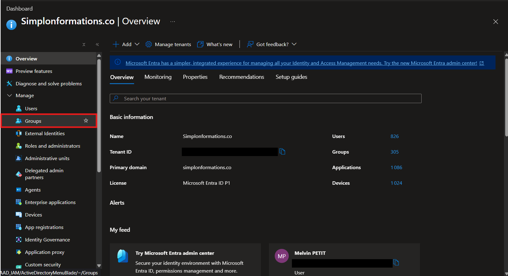
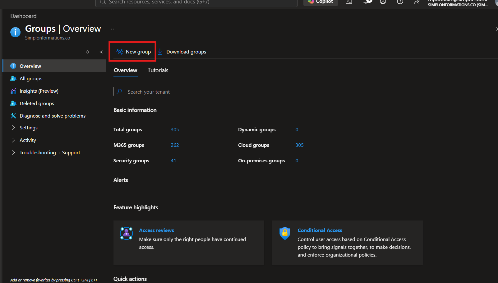
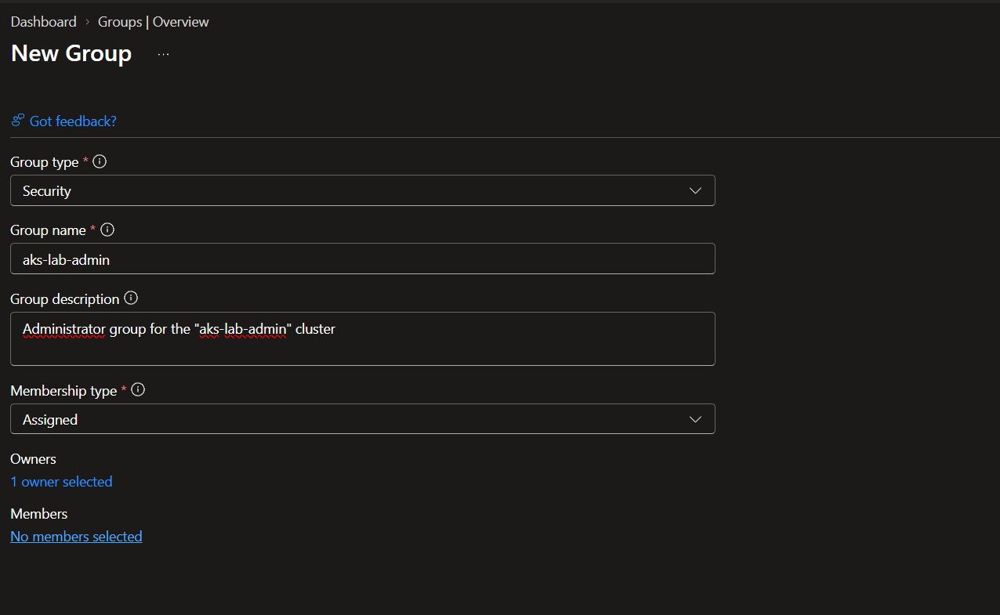
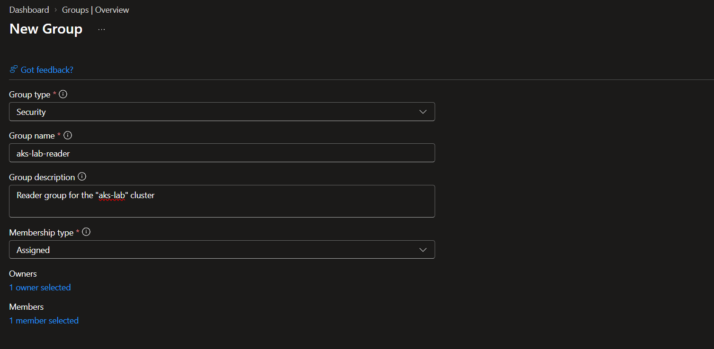
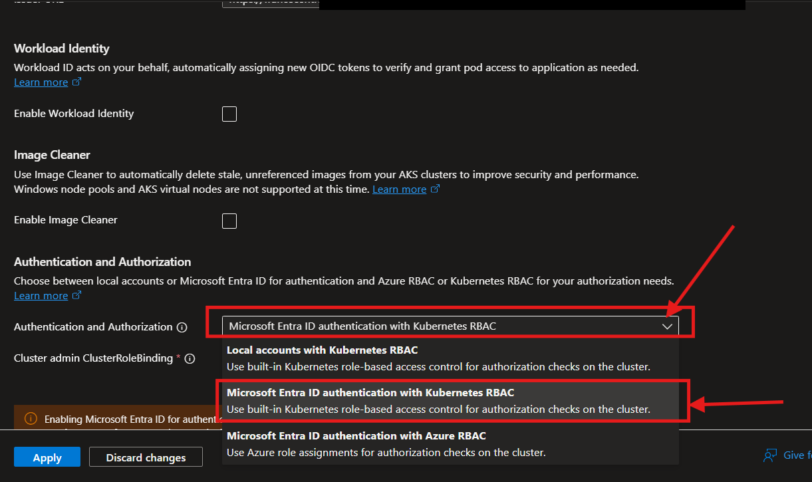
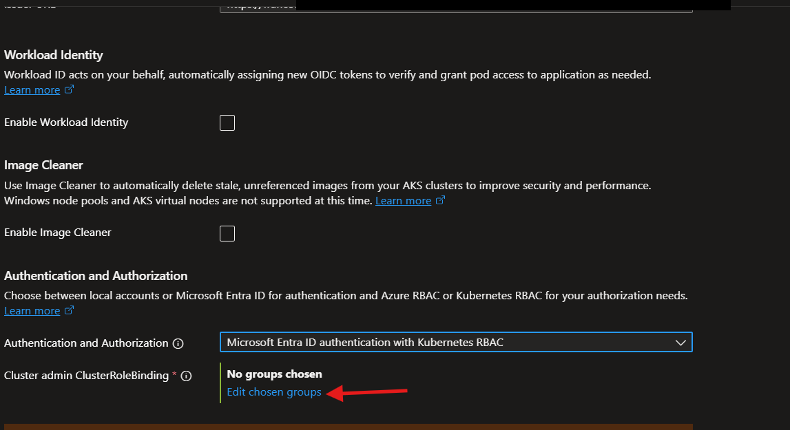
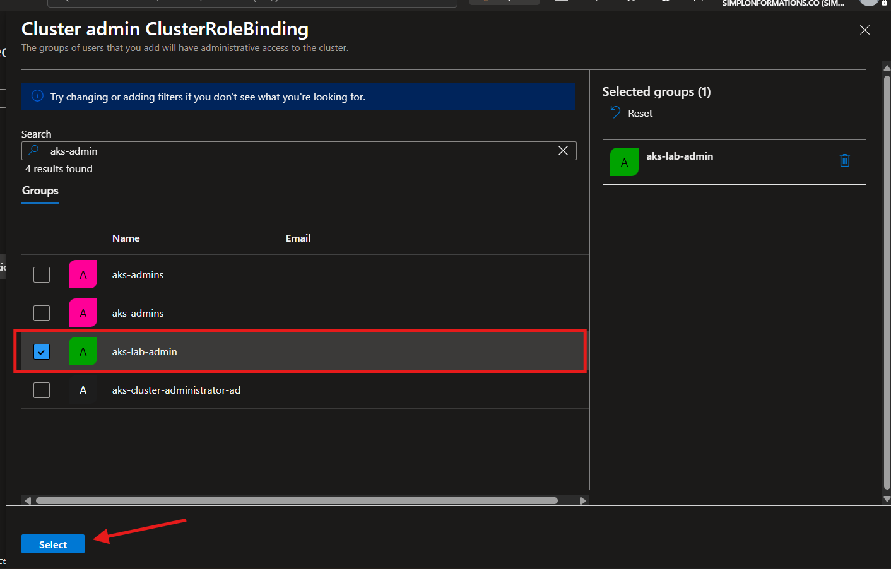

# Step 2: Replace local cluster admin with Microsoft Entra ID identities

## Goal

Make every access to the Kubernetes API server go through a real corporate
identity, and give each identity only the permissions it needs.

Two Microsoft Entra ID groups drive the whole model:

| Group | Members | Cluster permissions |
| --- | --- | --- |
| `aks-lab-admin` | the cluster operator only | full administration (`cluster-admin`) |
| `aks-lab-reader` | the trainer | read only (`view`) |

## Why this step is the core of the mission

Step 1 restricted *where* the cluster can be reached from. It did not change
*who* is allowed in.

Today the cluster still runs on local Kubernetes accounts. Anyone on the
subscription holding a sufficient Azure role can download the admin kubeconfig
with `az aks get-credentials --admin` and obtain full control. That credential
is a certificate, it bypasses Microsoft Entra ID entirely, and the Microsoft
documentation describes it plainly as a non-auditable backdoor.

Moving to Entra ID fixes three things at once:

1. Access follows the identity lifecycle. Removing someone from a group removes
   their cluster access, with no action on the cluster itself.
2. Conditional Access and multifactor authentication apply to cluster access.
3. Sign-ins are auditable centrally, instead of being anonymous certificate use.

## Design decision: Kubernetes RBAC or Azure RBAC

Once Entra ID handles authentication, authorization can be delegated to either
model. Both are supported.

| | Kubernetes RBAC | Azure RBAC for Kubernetes |
| --- | --- | --- |
| Permissions stored in | the cluster, as RBAC objects | Azure, as role assignments |
| Granting read access | a `ClusterRoleBinding` to the `view` role | assign *Azure Kubernetes Service RBAC Reader* |
| Scales across clusters | one binding per cluster | one assignment can cover many clusters |
| Portable to non-AKS | yes, standard Kubernetes | no, Azure specific |

**Kubernetes RBAC was chosen here.** The permission model then lives in this
repository as reviewable YAML, and it stays valid on any Kubernetes
distribution. Azure RBAC would be the better answer for a fleet of clusters
governed centrally, which is not the situation described in the brief.

## Order of operations

The sequence below is not arbitrary. **Local accounts are disabled last**, only
after Entra ID sign-in has been proven to work. Reversing these two steps locks
the operator out of the cluster.

## A. Create the two Entra ID groups

Azure portal, Microsoft Entra ID > Groups:





Both groups are created with **Group type: Security** and **Membership type:
Assigned**. A Microsoft 365 group would also work as an identity, but a security
group is the right object for granting permissions.





CLI equivalent:

```bash
az ad group create --display-name aks-lab-admin  --mail-nickname aks-lab-admin
az ad group create --display-name aks-lab-reader --mail-nickname aks-lab-reader

ADMIN_ID=$(az ad group show --group aks-lab-admin  --query id -o tsv)
READER_ID=$(az ad group show --group aks-lab-reader --query id -o tsv)
```

> Creating groups requires the right to do so in the tenant. On a shared
> training tenant this permission is often restricted, so test it first: being
> blocked here blocks the entire mission.

## B. Enable Entra ID authentication on the cluster

Azure portal, cluster > **Security configuration** > Authentication and
Authorization. Three modes are offered:



`Microsoft Entra ID authentication with Kubernetes RBAC` is the one matching the
design decision above.



The **Cluster admin ClusterRoleBinding** field takes the admin group. Azure
creates the binding to `cluster-admin` itself, so no YAML is needed for admins.



CLI equivalent:

```bash
az aks update \
  --resource-group mpetitRG \
  --name aks-lab \
  --enable-aad \
  --aad-admin-group-object-ids "$ADMIN_ID"
```

## C. Verify admin access before going further

```bash
az aks install-cli        # installs kubectl and kubelogin
az aks get-credentials --resource-group mpetitRG --name aks-lab --overwrite-existing
kubectl get nodes
```

`kubectl` now opens an interactive Microsoft Entra sign-in in the browser. That
prompt is the proof the integration is active. If the node list comes back, the
Entra path works and the next steps are safe to apply.

The `kubelogin` plugin is required for non-interactive sign-in, for example from
a script or a pipeline.

## D. Grant read-only access to the readers group

This step has two halves, and the second one is easy to forget.

### D1. Inside the cluster, the RBAC binding

Unlike the admin group, the readers group gets no automatic binding. It is
declared in [`k8s/rbac/reader-clusterrolebinding.yaml`](../../k8s/rbac/reader-clusterrolebinding.yaml):

```yaml
apiVersion: rbac.authorization.k8s.io/v1
kind: ClusterRoleBinding
metadata:
  name: aks-lab-reader-view
roleRef:
  apiGroup: rbac.authorization.k8s.io
  kind: ClusterRole
  name: view
subjects:
  - apiGroup: rbac.authorization.k8s.io
    kind: Group
    name: __READER_GROUP_OBJECT_ID__
```

Apply it by resolving the placeholder at apply time:

```bash
READER_ID=$(az ad group show --group aks-lab-reader --query id -o tsv)

sed "s/__READER_GROUP_OBJECT_ID__/$READER_ID/" \
  k8s/rbac/reader-clusterrolebinding.yaml | kubectl apply -f -
```

**The subject name must be the group object id, not its display name.** This is
the most common mistake on this step. Kubernetes has no knowledge of Entra
display names, it only reads the identifiers carried by the token.

The group object id is kept out of this repository, which is public, and
resolved at apply time instead. The manifest stays reusable for any tenant.

`view` is a built-in Kubernetes ClusterRole. It grants read access to most
namespaced resources, and deliberately excludes Secrets.

### D2. In Azure, the right to obtain a kubeconfig

The binding above grants permissions *inside* the cluster. It does not grant the
right to *download the kubeconfig*, which is an Azure control plane operation.
Without it, `az aks get-credentials` fails and the user never even reaches the
API server.

Both groups therefore need the **Azure Kubernetes Service Cluster User Role**,
scoped to the cluster:

```bash
CLUSTER_ID=$(az aks show -g mpetitRG -n aks-lab --query id -o tsv)

for GROUP_ID in "$ADMIN_ID" "$READER_ID"; do
  az role assignment create \
    --assignee "$GROUP_ID" \
    --role "Azure Kubernetes Service Cluster User Role" \
    --scope "$CLUSTER_ID"
done
```

Creating role assignments requires Owner or User Access Administrator on the
scope. On a shared training subscription this may be refused, in which case the
action has to be handed to whoever holds those rights.

### Verification without involving the trainer

A cluster administrator can simulate the readers group and check the three
answers that matter:

```bash
kubectl auth can-i list pods   --as=test@example.com --as-group=$READER_ID   # expected: yes
kubectl auth can-i delete pods --as=test@example.com --as-group=$READER_ID   # expected: no
kubectl auth can-i get secrets --as=test@example.com --as-group=$READER_ID   # expected: no
```

Read allowed, write refused, Secrets out of reach. This proves the binding
behaves as intended without waiting for the trainer to sign in.

## E. Disable local accounts

This is the decisive command of the whole mission. Everything before it adds a
clean path, this one closes the old one.

```bash
az aks update --resource-group mpetitRG --name aks-lab --disable-local-accounts
```

Verification: the command below must now **fail**.

```bash
az aks get-credentials --resource-group mpetitRG --name aks-lab --admin
# Operation failed with status: 'Bad Request'. Details: Getting static
# credential isn't allowed because this cluster is set to disable local accounts.
```

One consequence that is often skipped: on a cluster where people may already
have used local accounts, the previously issued certificates remain valid.
Microsoft's guidance is to [rotate the cluster certificates](https://learn.microsoft.com/azure/aks/certificate-rotation)
afterwards to revoke them. On a brand new cluster this is unnecessary.

## F. Remove over-broad Azure role assignments

The brief requires that **only** the members of the two groups can connect.
Disabling local accounts is not enough on its own: an Azure role such as
*Azure Kubernetes Service Cluster Admin Role*, assigned at subscription scope,
still opens a path into the cluster.

```bash
az role assignment list --scope /subscriptions/<SUBSCRIPTION_ID> -o table
```

Anything broader than the two groups above should be removed. On a subscription
shared between several users, this normally exceeds the operator's own rights
and is documented as an action for the subscription owners.

## Expected impact

| Effect | Detail |
| --- | --- |
| Sign-in experience | `kubectl` triggers an interactive Entra ID sign-in |
| Admin group members | full cluster administration, unchanged capabilities |
| Reader group members | read only, no Secrets, no write operations |
| Everyone else | authenticated but authorized for nothing, or refused at the kubeconfig step |
| `--admin` kubeconfig | no longer issued, for anyone |
| Running workloads | unaffected, this changes human access only |
| Role assignment propagation | up to 5 minutes |

## Troubleshooting

| Symptom | Likely cause |
| --- | --- |
| `Error from server (Forbidden)` after a successful sign-in | Authentication worked, authorization did not. Wrong or missing binding, or the object id was replaced by a display name |
| `az aks get-credentials` fails for a reader | Missing *Azure Kubernetes Service Cluster User Role*, see D2 |
| No browser prompt appears | Stale kubeconfig entry. Re-run `az aks get-credentials --overwrite-existing` |
| Sign-in works but the group grants nothing | Role assignments can take up to 5 minutes to propagate |

## Rollback and break-glass

Local accounts can be re-enabled, which is the documented emergency path when
Entra ID sign-in is unavailable:

```bash
az aks update -g mpetitRG -n aks-lab --enable-local-accounts
az aks get-credentials -g mpetitRG -n aks-lab --admin
# ... then disable them again once Entra sign-in is restored
az aks update -g mpetitRG -n aks-lab --disable-local-accounts
```

This path is evaluated by Azure Resource Manager, not by the Kubernetes API
server, so it still works when `kubectl` refuses every request. It requires the
*Azure Kubernetes Service Contributor* role on the cluster.

The RBAC binding is removed with:

```bash
kubectl delete clusterrolebinding aks-lab-reader-view
```

## Known limitations and risks

**The Entra ID integration should be treated as one way.** Microsoft states
explicitly for AKS on Azure Local that the integration cannot be disabled once
added. No equivalent statement was found for standard AKS in the documentation
consulted, so the cautious assumption applies. A misconfigured admin group does
not require rolling back the integration, it is fixed with
`az aks update --aad-admin-group-object-ids`.

**Tenant alignment.** The Entra tenant used for authentication must be the same
as the tenant of the subscription hosting the cluster.

**Group creation rights.** Creating the two groups depends on tenant level
permissions that an ordinary user may not hold.

**Role assignment rights.** Steps D2 and F both require elevated Azure rights
that are typically not granted on a shared subscription.

## References

- [Enable Microsoft Entra ID authentication for the AKS control plane](https://learn.microsoft.com/azure/aks/entra-id-control-plane-authentication)
- [Manage local accounts with Microsoft Entra integration](https://learn.microsoft.com/azure/aks/local-accounts)
- [Use Kubernetes RBAC with Microsoft Entra ID in AKS](https://learn.microsoft.com/azure/aks/kubernetes-rbac-entra-id)
- [Cluster authentication concepts in AKS](https://learn.microsoft.com/azure/aks/concepts-cluster-authentication)
- [Use Microsoft Entra ID authorization for the Kubernetes API](https://learn.microsoft.com/azure/aks/entra-id-authorization)
